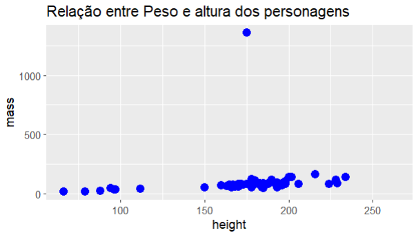
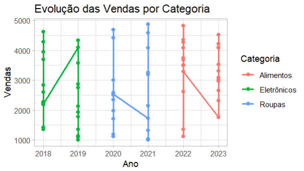
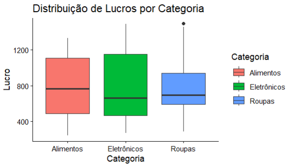
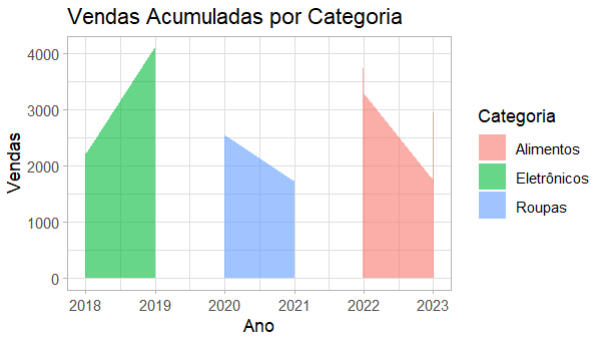
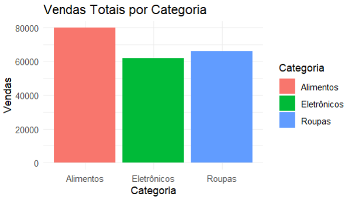
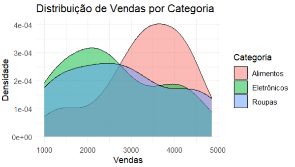
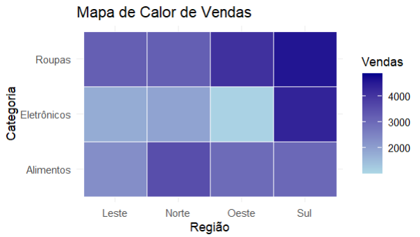
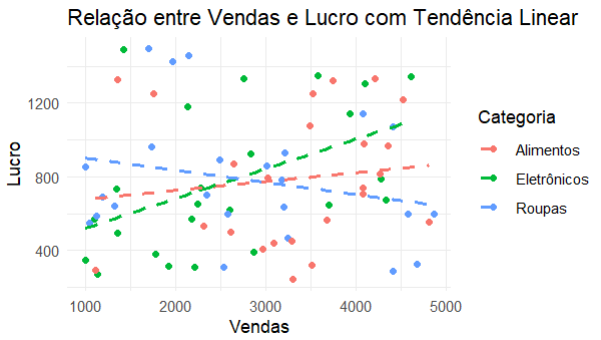

# 📌 Utilização de Gráficos com ggplot2 em R

Estudo sobre a utilização do pacote ggplot2 para visualização de gráficos em linguagem R. Este projeto apresenta alguns dos principais tipos de gráficos do 
pacote `ggplot2`**, uma das bibliotecas mais poderosas de visualização de dados do R.

---

## 📌 Estrutura dos Dados

O dataframe contém informações simuladas de **vendas, lucro e clientes**, por **ano, mês, categoria e região**:

```r
# Criação do dataframe de teste
dados <- data.frame(
  Ano = rep(2018:2023, each = 12),            # anos
  Mês = rep(month.abb, times = 6),            # meses abreviados (Jan, Feb, ...)
  Categoria = rep(c("Eletrônicos", "Roupas", "Alimentos"), each = 24), # 3 categorias
  Região = rep(c("Norte", "Sul", "Leste", "Oeste"), times = 18),       # 4 regiões
  Vendas = round(runif(72, 1000, 5000), 0),   # vendas aleatórias
  Lucro = round(runif(72, 200, 1500), 0),     # lucro aleatório
  Clientes = round(runif(72, 50, 300), 0)     # número de clientes
)

```

---

## 📌 Gráficos:











---

## 📌 Pré-requisitos
Antes de rodar o projeto, você precisa ter:

* [Linguagem R](https://cran.r-project.org/) instalada (versão recomendada: ≥ 4.5.1)
* [RStudio](https://posit.co/download/rstudio-desktop/) instalado
* Instalação da [Linguagem R:](https://informaticus77-r.blogspot.com/2025/09/blog-post.html)
* Microtutorial [RStudio:](https://informaticus77-r.blogspot.com/2025/09/blog-post_8.html)

---

## 📌 Clonar este repositório
Abra o terminal e execute:
```bash
git clone https://github.com/jcarlossc/ggplot2-graphs.git
cd ggplot2-graphs
```

---

## 📌 Ativar ambiente virtual com renv
Este projeto utiliza o pacote renv para gerenciar dependências de forma reprodutível.
1. Abra o projeto no RStudio.
2. Ative o ambiente e restaure as dependências:
```
# Estes comandos devem ser executados no console do RStudio.

renv::activate()   # Ativa o ambiente virtual
renv::restore()    # Instala as dependências
```
3. Verifique se tudo está funcionando:
```
# Este comando deve ser executado no console do RStudio.
renv::status()
```

---

## 📌 Sobre
Este material foi criado para servir como introdução ao R, com exemplos simples e organizados para facilitar o aprendizado inicial.

---

## 📌 Contribuições
Se quiser contribuir:
1. Faça um fork deste repositório
2. Crie uma branch para sua feature ou correção (git checkout -b minha-feature)
3. Faça commits descritos claramente
4. Submeta um Pull Request

---

## 📌 Licença
Este projeto está licenciado sob a MIT License.

---

## 📌 Contatos
📌Autor: Carlos da Costa<br>
📌Recife, PE - Brasil<br>
📌Telefone: +55 81 99712 9140<br>
📌Telegram: @jcarlossc<br>
📌Pypi: [@jcarlossc](https://pypi.org/user/jcarlossc/)<br>
📌Blogger linguagem R: [https://informaticus77-r.blogspot.com/](https://informaticus77-r.blogspot.com/)<br>
📌Blogger linguagem Python: [https://informaticus77-python.blogspot.com/](https://informaticus77-python.blogspot.com/)<br>
📌Email: jcarlossc1977@gmail.com<br>
📌Portfólio em construção: https://portfolio-carlos-costa.netlify.app/<br>
📌LinkedIn: https://www.linkedin.com/in/carlos-da-costa-669252149/<br>
📌GitHub: https://github.com/jcarlossc<br>
📌Kaggle: https://www.kaggle.com/jcarlossc/  
📌Twitter/X: https://x.com/jcarlossc1977

---
